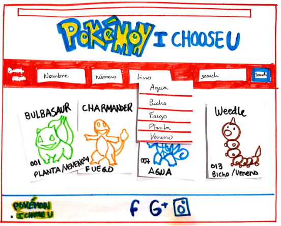
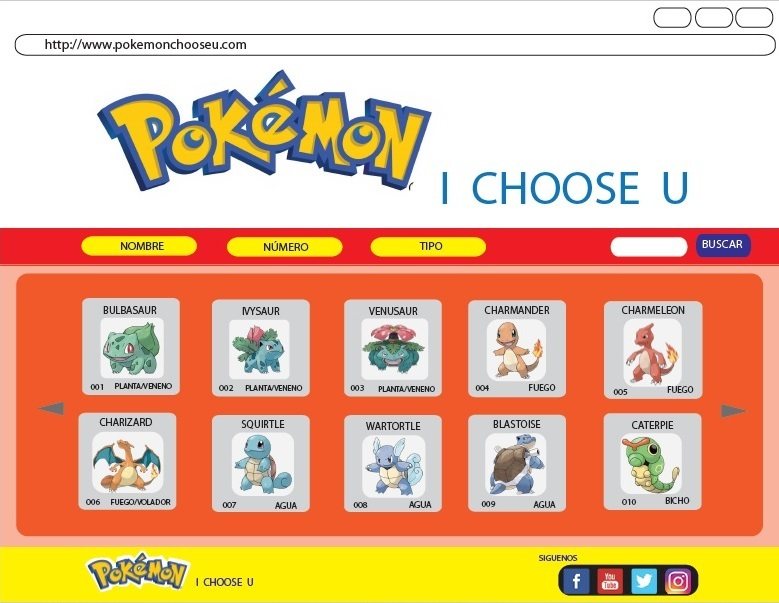

# Data Lovers
 

Para ir a la página;

[https://paulatorress.github.io/SCL009-data-lovers/src/index.html](https://paulatorress.github.io/SCL009-data-lovers/src/index.html)

***
**Pokemom I Choose U**

# POKÉMON I CHOOSE YOU

Pokémon I Choose You es una página web la cual sirve exclusivamente para que el usuario pueda filtrar, ordenar y visualizar un cálculo (porcentaje) sobre información de los 151 Pokemon existentes de la Primera Generación.

Esta página va dirigida especialmente a usuarios principiantes fanáticos de Pokémon los cuales quieran conocer en detalle informacion de cada Pokémon (su nombre, numero, tipo, debilidades y visualizar que porcentaje en relación a los 151 Pokemon cubren respecto a su tipo).

# Historias de Usuario
 

Esta web se creó en base a 3 casos de Historias de Usuario
los cuales cada uno tiene su criterio de aceptación tales como:

Caso 1 - Filtrar Data

Como: Usuario principante y fanático de Pokémon
Quiero: Una caja search para filtrar por Nombre, Numero y Tipo.
Para: Elegir, conocer y aprender más sobre cada uno de ellos

Caso 2 - Ordenar Data

Como: Usuario principante y Fanático de Pokemon
Quiero: Botones para Ordenar por Nombre o Numero, en orden creciente o decreciente(A-Z, Z-A,1_151 y !51-1)
Para: Elegir, conocer y aprender más sobre cada uno de ellos

Caso 3 - Calcular Data

Como: Usuario principiante y Fanático de Pokémon
Quiero: Tarjetas informativas para visualizar más detalles del Pokemón y el porcentaje de tipos de Pokemon
Para: Comparar, conocer y aprender más sobre cada uno de ellos

# Entrevista de Usuario
Para detectar problemas de usabilidad realizamos una encuesta sobre que información sobre Pokémons
necesitan los usuarios a la hora de interactuar con una web sobre Pokemón. Recibimos un total de 24 respuestas.

Con la encuesta fue posible definir más detalles sobre el perfil de nuestro usuario - un 58,3% de los entrevistados tenían entre 21 e 30 años y un 33,3% tenían entre 31 y 41 años de edad - así que nuestro usuario tiene entre 20 e 40 años de edad.
 

Igualmente fue posible definir el nivel de nuestro usuario en relacción al juego Pokémon GO. Eligimos enfocar en el usuario principiante, una vez que al preguntar a los entrevistados su nivel de jugador, el porcentaje de cada opción fueron equitativos. 
 
 
Un 29% de los entrevistados dijeron lo que los hace gustar a los pokémons son su diferentes habilidades como tipo, debilidad , etc. Así que nos enfocamos en mostrar estos datos en las tarjetas de descripción de cada Pokémon.
 

Link:
[Encuesta Pokémon](https://docs.google.com/forms/d/1z3-EKwpr1To573f6QbLjaixxmUusFJKSTBN4tBkBpLc/viewform?edit_requested=true)

# Proceso de Diseño (Diseño de la Intefaz de Usuario)

## Prototipo de Baja Fidelidad

Durante el proceso de Diseño de nuestra web fuímos creando la Interfaz de Usuario a travez 
de Prototipos de Baja Fidelidad (realización de sketches, bocetos) aqui algunas imagenes del
proceso: 

 
 
 
 
 
 

## Prototipo de alta fidelidad

Luego creamos el Prototipo de Alta Fidelidad, el cual representa nuestro diseño ideal de 
la solución, incluyendo más opciones al Usuario.
Aquí la visualización
del prototipo:

 
 
 
 

Link:
[zeplin](https://zpl.io/V0LKg4K)

# Testeos de usabilidad

Con nuestro prototipo de baja fidelidad notamos que ciertos aspectos no calzaban de acuerdo a los principios de diseño (balance, proximidad, alineación, repetición, contraste y espacio.
Los botones en la barra de navegación (nombre y número) eran poco claros a la hora de entender que quería hacer el usuario (según nuestra 2° historia de usuario "Ordenar")
Quedando como solución en nuestra web un botón llamado "Ordenar" el cual permite al usuario poder visualizar la data de los 151 Pokémon desde la A - Z y Z - A y de la misma manera pero con números 1 - 151 y 151 - 1. Dejando la data de manera ordenada según se adapte a lo que prefiera el usuario (letra o número).
